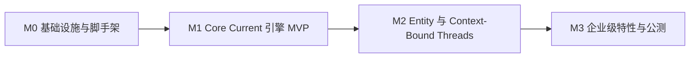

# 分阶段里程碑 M0–M3

本文件将方案拆解为可执行、可验收的里程碑。每个阶段包含目标、交付物、任务清单与退出标准。任务清单以勾选框形式给出，供实施阶段逐项落实。

## 里程碑总览

## M0 — 基础设施与脚手架

**目标**：可运行、可测试、可持续集成的地基。

**交付物**：
- Turborepo + pnpm + Tailwind v4 + TS7 Strict 全量配置，CI 管线打通 remote cache。
- Drizzle 基础 schema 落地：`realms`、`projects`、`members`、`entities`、`threads`、`currents`、`audit_log`。
- Better-Auth 完成 Realm Tree 三级模型接线。
- Yjs Provider 基线在编辑器宿主内可用，Presence 通道打通。

**任务清单**：

- [x] `@aether/config`：TS7 Strict、ESLint/Biome、Tailwind v4 共享配置
- [x] `@aether/types`：共享类型与 schema 类型生成
- [x] `@aether/db`：核心 schema + Drizzle Kit 迁移脚本
- [x] `@aether/auth`：Better-Auth 三级模型（Realm > Project > Member）
- [x] `@aether/editor-host`：Yjs Provider 基线 + Presence 通道
- [x] CI 管线：build / lint / test / typecheck，remote cache 打通
- [x] 技术探测：Yjs 在 Serverless 环境的持久化与连接管理（见 [risks.md](./risks.md)，详见 [探测报告](./probes/yjs-serverless.md)）

**退出标准**：
- 新成员 clone 后一条命令启动全栈。
- CI 全绿，remote cache 命中生效。
- 空 Realm 可创建、可授权、可写入一条 CRDT 更新。

## M1 — Core Current 引擎 MVP

**目标**：The Current 成为可用的协同状态总线。

**交付物**：
- `@aether/current-sync`：Realm 级 Y.Doc 分区、Presence Stream、Converge Engine 基础冲突策略。
- Next 16 Server Actions 状态通道：客户端 CRDT 更新经 Server Action 落库，服务端广播回客户端，与 Hocuspocus 收敛服务联动。
- Drift Persistence：IndexedDB 持久化 + Reconnect Handshake 增量对账。
- 编辑器宿主从 Current 渲染代码，多光标可见。

**任务清单**：

- [x] `@aether/current-sync`：Realm Channel Partition 实现
- [x] Converge Engine：基础字段级冲突策略
- [x] Server Actions 状态通道：更新落库 + 广播
- [x] Hocuspocus 收敛服务接入
- [x] Drift Persistence：IndexedDB 持久化
- [x] Reconnect Handshake：增量对账
- [x] Cursor Wavefront：多光标渲染
- [x] `@aether/state`：Zustand store 与 Yjs 双向绑定

**退出标准**：
- 双客户端并发编辑无数据丢失。
- 断网编辑 10 分钟后重连，零手工干预完成 Converge。
- 操作全部落 `audit_log`。

## M2 — Entity 集成与 Context-Bound Threads

**目标**：AI 成为一等成员，Thread 成为钉在代码上的叙事。

**交付物**：
- `@aether/entity-core`：Entity Identity、Capability Manifesto、Entity Audit Trail、Handoff Gate 状态机。
- Vercel AI SDK 接入 Entity 运行时，Entity 具备在场光标与对话能力。
- `@aether/thread-bindings`：Code Anchor Binding、Dialogue Forging、Rehydration Path 全链路。
- `@aether/manifestation`：Manifestation Binding + Inline Annotation 可用。

**任务清单**：

- [x] `@aether/entity-core`：Entity Identity（Better-Auth 身份）
- [x] Capability Manifesto 声明与校验
- [x] Entity Audit Trail 埋点
- [x] Handoff Gate 状态机（`waiting` 状态 + 人类确认流）
- [x] Vercel AI SDK 接入 Entity 运行时
- [x] Entity Presence Cursor
- [x] `@aether/thread-bindings`：Code Anchor Binding
- [x] Dialogue Forging：Thread 内嵌对话历史
- [x] Rehydration Path：上下文重建
- [x] `@aether/manifestation`：Inline Annotation（CRDT 持久化）
- [x] Manifestation Binding

**退出标准**：
- Entity 以独立身份参与 Current，操作全量可审计。
- Thread 绑定代码锚点，并可在代码重构后迁移。
- 对 Manifestation 的标注作为 CRDT 数据持久化，多人可见。

## M3 — 企业级特性与公测

**目标**：多租户加固、生态开放、性能达标。

**交付物**：
- 多 Realm 加固：Entitlement Engine、Audit Vault、SSO/SCIM、Realm Isolation 生产级验证。
- `@aether/resonance`：公开 Gateway、Webhook Constellation、OAuth App Registry；内部功能全部切换为走公开 API。
- Resonance Marketplace 内测、Self-host Beacon 基线。
- 性能与观测：PPR/Edge 优化、Converge Telemetry、冷启动降幅达标。

**任务清单**：

- [x] Entitlement Engine：角色 / 作用域 / 资源三级判定
- [x] Audit Vault：审计中心与导出
- [x] SSO / SCIM 接入
  - 已完成服务端会话主体解析、Realm membership provisioning（邀请 + JIT 镜像）、邀请邮件投递与既有占位 Realm organization 回填、OIDC 外部 IdP 登录与 Web 登录 UI（M3.14），以及 SCIM 2.0 provisioning 端点（Users 列表 / 创建 / PATCH 启用禁用 / DELETE 回收，M3.15）。SSO/SCIM 任务整体收口。
- [ ] Realm Isolation 生产级验证
- [ ] Resonance Gateway：全资源公开 API
- [ ] 内部功能 API 化改造（API-First 兑现）
- [ ] Webhook Constellation：订阅、签名、重试
- [ ] OAuth App Registry
- [ ] Resonance Marketplace 内测
- [ ] Self-host Beacon：Dockerfile 与部署基线
- [ ] 性能优化：PPR / Edge / 冷启动
- [ ] Converge Telemetry 采集上线

**退出标准**：
- 独立第三方应用仅凭公开 API 完成一次完整协同闭环。
- 审计报告覆盖人机双方，可导出。
- P95 交互延迟达到公测指标。

## 里程碑依赖与风险门禁

- M0 末完成 Yjs Serverless 持久化技术探测（[risks.md](./risks.md) 风险 1），探测结果决定 M1 收敛服务部署形态。
- M1 末验证 Drizzle Serverless 连接池与冷启动表现（风险 2），决定 M3 的缓存与异步化方案。
- M3 的 Resonance Gateway 依赖全部内部功能完成 API 化，这是 API-First 主张的验收点。
