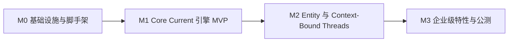

# 分阶段里程碑 M0–M3

本文件将方案拆解为可执行、可验收的里程碑。每个阶段包含目标、交付物、任务清单与退出标准。任务清单以勾选框形式给出，供实施阶段逐项落实。

## 里程碑总览

## M0 — 基础设施与脚手架

**目标**：可运行、可测试、可持续集成的地基。

**交付物**：
- Turborepo + pnpm + Tailwind v4 + TS7 Strict 全量配置，CI 管线打通 remote cache。
- Drizzle 基础 schema 落地：`realms`、`projects`、`members`、`entities`、`threads`、`currents`、`audit_log`。
- Better-Auth 完成 Realm Tree 三级模型接线。
- Yjs Provider 基线在编辑器宿主内可用，Presence 通道打通。

**任务清单**：

- [x] `@aether/config`：TS7 Strict、ESLint/Biome、Tailwind v4 共享配置
- [x] `@aether/types`：共享类型与 schema 类型生成
- [x] `@aether/db`：核心 schema + Drizzle Kit 迁移脚本
- [x] `@aether/auth`：Better-Auth 三级模型（Realm > Project > Member）
- [x] `@aether/editor-host`：Yjs Provider 基线 + Presence 通道
- [x] CI 管线：build / lint / test / typecheck，remote cache 打通
- [x] 技术探测：Yjs 在 Serverless 环境的持久化与连接管理（见 [risks.md](./risks.md)，详见 [探测报告](./probes/yjs-serverless.md)）

**退出标准**：
- 新成员 clone 后一条命令启动全栈。
- CI 全绿，remote cache 命中生效。
- 空 Realm 可创建、可授权、可写入一条 CRDT 更新。

## M1 — Core Current 引擎 MVP

**目标**：The Current 成为可用的协同状态总线。

**交付物**：
- `@aether/current-sync`：Realm 级 Y.Doc 分区、Presence Stream、Converge Engine 基础冲突策略。
- Next 16 Server Actions 状态通道：客户端 CRDT 更新经 Server Action 落库，服务端广播回客户端，与 Hocuspocus 收敛服务联动。
- Drift Persistence：IndexedDB 持久化 + Reconnect Handshake 增量对账。
- 编辑器宿主从 Current 渲染代码，多光标可见。

**任务清单**：

- [x] `@aether/current-sync`：Realm Channel Partition 实现
- [x] Converge Engine：基础字段级冲突策略
- [x] Server Actions 状态通道：更新落库 + 广播
- [x] Hocuspocus 收敛服务接入
- [x] Drift Persistence：IndexedDB 持久化
- [x] Reconnect Handshake：增量对账
- [x] Cursor Wavefront：多光标渲染
- [x] `@aether/state`：Zustand store 与 Yjs 双向绑定

**退出标准**：
- 双客户端并发编辑无数据丢失。
- 断网编辑 10 分钟后重连，零手工干预完成 Converge。
- 操作全部落 `audit_log`。

## M2 — Entity 集成与 Context-Bound Threads

**目标**：AI 成为一等成员，Thread 成为钉在代码上的叙事。

**交付物**：
- `@aether/entity-core`：Entity Identity、Capability Manifesto、Entity Audit Trail、Handoff Gate 状态机。
- Vercel AI SDK 接入 Entity 运行时，Entity 具备在场光标与对话能力。
- `@aether/thread-bindings`：Code Anchor Binding、Dialogue Forging、Rehydration Path 全链路。
- `@aether/manifestation`：Manifestation Binding + Inline Annotation 可用。

**任务清单**：

- [x] `@aether/entity-core`：Entity Identity（Better-Auth 身份）
- [x] Capability Manifesto 声明与校验
- [x] Entity Audit Trail 埋点
- [x] Handoff Gate 状态机（`waiting` 状态 + 人类确认流）
- [x] Vercel AI SDK 接入 Entity 运行时
- [x] Entity Presence Cursor
- [x] `@aether/thread-bindings`：Code Anchor Binding
- [x] Dialogue Forging：Thread 内嵌对话历史
- [x] Rehydration Path：上下文重建
- [x] `@aether/manifestation`：Inline Annotation（CRDT 持久化）
- [x] Manifestation Binding

**退出标准**：
- Entity 以独立身份参与 Current，操作全量可审计。
- Thread 绑定代码锚点，并可在代码重构后迁移。
- 对 Manifestation 的标注作为 CRDT 数据持久化，多人可见。

## M3 — 企业级特性与公测

**目标**：多租户加固、生态开放、性能达标。

**交付物**：
- 多 Realm 加固：Entitlement Engine、Audit Vault、SSO/SCIM、Realm Isolation 生产级验证。
- `@aether/resonance`：公开 Gateway、Webhook Constellation、OAuth App Registry；内部功能全部切换为走公开 API。
- Resonance Marketplace 内测、Self-host Beacon 基线。
- 性能与观测：PPR/Edge 优化、Converge Telemetry、冷启动降幅达标。

**任务清单**：

- [x] Entitlement Engine：角色 / 作用域 / 资源三级判定
- [x] Audit Vault：审计中心与导出
- [x] SSO / SCIM 接入
  - 已完成服务端会话主体解析、Realm membership provisioning（邀请 + JIT 镜像）、邀请邮件投递与既有占位 Realm organization 回填、OIDC 外部 IdP 登录与 Web 登录 UI（M3.14），以及 SCIM 2.0 provisioning 端点（Users 列表 / 创建 / PATCH 启用禁用 / DELETE 回收，M3.15）。SSO/SCIM 任务整体收口。
- [ ] Realm Isolation 生产级验证
- [x] Resonance Gateway：全资源公开 API
  - M3.16 已落地 v1 核心资源端点（Realm / Project / Thread / Dialogue / Entity / Current）与 API Key 鉴权（`aeth_` 前缀 + SHA-256 哈希存储 + fail-closed 三重校验），密钥管理入口位于 Realm 设置页，全部写操作以 `api-key:<keyId>` 服务主体落审计。规范见 [specs/m316-resonance-gateway.md](../specs/m316-resonance-gateway.md)。
- [x] 内部功能 API 化改造（API-First 兑现）
  - M3.18 已落地业务核心层 `lib/resonance/core.ts`（与主体无关、与传输无关）：project 归属校验、Thread 状态机、dialogue_ref 竞争回写、同事务审计与事务性 outbox 在此唯一实现。三通道全部消费：公开 API（`/api/v1` 薄委托，行为不变）、会话 Server Actions（createThread 补齐审计缺口，归因当前用户）、GitHub 集成（issue/comment/PR 五路径获得状态机 + 审计 + Webhook 事件；人工归档的 Thread 不被 GitHub 状态强制迁移）。审计幂等键前缀改为通道 source（`api-key:` / `session:` / `github:`）。规范见 [specs/m318-internal-api-first.md](../specs/m318-internal-api-first.md)。
- [x] Webhook Constellation：订阅、签名、重试
  - M3.17 已落地出站事件订阅（`webhook_subscriptions` / `webhook_deliveries` 事务性 outbox）、HMAC-SHA256 签名协议（`x-aether-signature-256`，明文 secret 仅创建时返回一次、AES-GCM 加密入库）、指数退避重试（30s 基准 × 2ⁿ 封顶 1h，8 次后 exhausted）与 Cron 扫描投递（`/api/webhooks/dispatch`，Bearer token fail-closed 鉴权）。v1 事件目录：`thread.created` / `thread.status_changed` / `dialogue.message_created`。规范见 [specs/m317-webhook-constellation.md](../specs/m317-webhook-constellation.md)。
- [x] OAuth App Registry
  - M3.19 已落地 OAuth 2.0 授权码流程（+ PKCE S256）：App 注册 / secret 轮换 / 软删除（`oauth_apps`，owner/admin）、同意页授权与 token 兑换（`/oauth/authorize` + `/api/oauth/token`，code 一次性 10 分钟、sha256 哈希入库、同 (app, user, realm) 轮换吊销）、`aoat_` 令牌双通道鉴权（`read`/`write` scope 按 method 强制，403 `insufficient_scope`）、成员自助授权吊销（Realm 设置 → Integrations）。管理 UI 与全部凭据明文仅一次性展示策略与 API Key 一致。规范见 [specs/m319-oauth-app-registry.md](../specs/m319-oauth-app-registry.md)。
- [x] Realm Isolation 生产级验证
  - M3.20 已落地跨 Realm 隔离测试套件（`tests/realm-isolation.test.ts`，16 用例）：覆盖三层守卫——令牌绑定单一 Realm、`requireRealmMatch` 路径守卫（`/realms/B/*` → 404 不触 db）、`requireThreadRow` 资源守卫（`/threads/<B-thread>` GET/PATCH/dialogues → 404）、列表隔离（A 令牌仅收 A 行）、写隔离（A 令牌引用 B 的 project_id → 400 invalid_project）、同 Realm 正向回归。验证 M3.16–M3.19 全链路多租户边界不可突破。规范见 [specs/m320-realm-isolation-verification.md](../specs/m320-realm-isolation-verification.md)。
  - M3.21 已落地 Webhook 投递跨 Realm 隔离端到端测试套件（`tests/webhook-realm-isolation.test.ts`，10 用例）：覆盖异步投递链路三层隔离——入队隔离（`enqueueWebhookDeliveries` 按 `realm_id` 过滤订阅，A 事件仅入 A 订阅）、投递隔离（`dispatchPendingWebhooks` 扫描时 A delivery 仅投递到 A 订阅 url，签名由各自订阅 secret 生成互不串用）、订阅方查询/删除隔离（令牌 A 查/删 B 订阅 → 404）、同 Realm 正向回归。补齐 M3.20 留出的"依赖 Cron + 真实 HTTP"缺口。规范见 [specs/m321-webhook-realm-isolation-e2e.md](../specs/m321-webhook-realm-isolation-e2e.md)。
- [ ] Resonance Marketplace 内测
- [ ] Self-host Beacon：Dockerfile 与部署基线
- [ ] 性能优化：PPR / Edge / 冷启动
- [x] Converge Telemetry 采集上线
  - M3.22 已落地 `@aether/observability` 指标层（Counter / Histogram / MetricsRegistry + Prometheus 文本导出，纯内存无外部依赖）与 converge-server 埋点：`onLoadDocument` 冷启动延迟（`converge_cold_start_seconds`）+ applyUpdate 失败计数（`converge_crdt_apply_failures_total`）、`onChange` 持久化延迟（`converge_persist_seconds`）+ 幂等键命中重复操作计数（`converge_persist_duplicates_total`）、`onDisconnect` 连接计数（`converge_connections_total`）。`/metrics` 端点（vercel.ts 路由，Prometheus 文本格式 `text/plain; version=0.0.4`）与 WebSocket 同实例共享 registry。`AETHER_CONVERGE_TELEMETRY_DISABLED=1` 可关停（no-op）。对齐 risks.md 风险 1/2/6 监控指标，解锁 M3 性能优化客观评估。规范见 [specs/m322-converge-telemetry.md](../specs/m322-converge-telemetry.md)。

**退出标准**：
- 独立第三方应用仅凭公开 API 完成一次完整协同闭环。
- 审计报告覆盖人机双方，可导出。
- P95 交互延迟达到公测指标。

## 愿景对齐 Wave A–C

对照愿景文档识别 M0–M3 已落地但未通电的能力差距，以 Wave 形式集中补齐。每个 Wave 独立提交、独立验证（typecheck + lint + test 全绿）。

### Wave A — Entity AI 闭环通电（commit `f6c0fbf`）

**目标**：把 Entity 从"抽象接入"变为"真实可对话"，Cmd+K 从"全局导航"变为"上下文敏感双模式"。

**交付物**：
- [x] 多 provider 适配层（`@aether/entity-core/provider.ts`）：OpenAI / Anthropic / Google 统一适配，环境变量配置切换
- [x] 流式对话端点（`app/api/threads/[threadId]/chat/route.ts`）：SSE 流式 + Entity 回复落库
- [x] Cmd+K 上下文敏感双模式（`command-palette.tsx`）：无选区→导航模式，有选区→提问模式（自动绑代码锚点）
- [x] Thread 对话视图（`thread-dialogue.tsx`）：流式消息 + Diff 解析 + Accept
- [x] Presence 聚合指示器：Humans / Entities in Current 计数

### Wave B — Manifestation 协同审查闭环（commit `663cdd5`）

**目标**：实现愿景"下午 2:00 场景"——预览嵌入右侧面板 + 元素级圈选标注 + 评论自动变成 Thread 并绑定代码。

**交付物**：
- [x] 预览面板（`manifestation-panel.tsx`）：iframe sandbox 渲染构建产物
- [x] 圈选标注覆盖层：鼠标拖拽生成矩形标注，记录坐标 + 元素 selector
- [x] 标注→Thread 闭环：`createThread` 绑 `manifestation_url` + `code_anchor`（含坐标/selector）
- [x] `current-workspace` 集成：编辑器/预览切换 + ThreadDialogue 预览入口

### Wave C — Drift 离线 UI 指示（commit `7086fec`）

**目标**：实现愿景"离线时仍可工作，重新连接后优雅合并"的可视指示。

**交付物**：
- [x] Drift 状态条（`drift-status-bar.tsx`）：`useOnlineStatus`（navigator.onLine + 事件）+ `useEditorConnection`（postMessage 跨 iframe）
- [x] 三态显示：离线（梅红 error）/ 未连接（warning 脉冲）/ 收敛中（中性脉冲）；在线已连接时不显示
- [x] editor-host `App.tsx` 加 `postMessage` 向 parent 传递连接状态

### 测试守护（commit `a49af49`）

**目标**：为 Wave A/B/C 新增代码补齐单元测试，防止后续重构回归。

**交付物**：
- [x] 5 个测试文件共 108 用例，覆盖率全部 ≥80%
  - `entity-core/tests/provider.test.ts`（20）：多 provider 适配 + 消息/工具转换
  - `web/tests/chat-route.test.ts`（14）：流式端点 9 错误分支 + 成功流式链路
  - `web/tests/components/drift-status-bar.test.tsx`（15）：离线/连接状态 + postMessage 类型守卫
  - `web/tests/components/manifestation-panel.test.tsx`（25）：模式切换 + 圈选标注 + createThread 闭环
  - `web/tests/components/command-palette.test.tsx`（34）：⌘K 唤起 + 导航/提问双模式 + 键盘选择
- [x] 修复 manifestation-panel 事件冒泡缺陷（`stopPropagation`）
- [x] 基础设施：`@vitest/coverage-v8` + `@testing-library/react` + jsdom + eslint 测试文件覆盖规则

## 里程碑依赖与风险门禁

- M0 末完成 Yjs Serverless 持久化技术探测（[risks.md](./risks.md) 风险 1），探测结果决定 M1 收敛服务部署形态。
- M1 末验证 Drizzle Serverless 连接池与冷启动表现（风险 2），决定 M3 的缓存与异步化方案。
- M3 的 Resonance Gateway 依赖全部内部功能完成 API 化，这是 API-First 主张的验收点。
